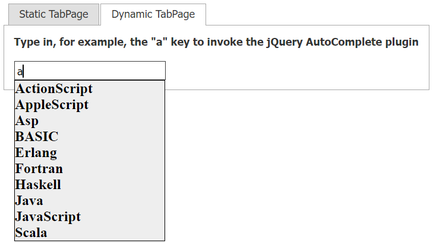

<!-- default badges list -->

[](https://supportcenter.devexpress.com/ticket/details/E3325)
[](https://docs.devexpress.com/GeneralInformation/403183)
<!-- default badges end -->
# Text Box for ASP.NET Web Forms - How to apply the jQuery AutoComplete plugin to an editor

This example demonstrates how to apply the jQuery `AutoComplete` plugin to a text box editor.



## Overview

To apply jQuery selectors to a text box editor, use one of the following approaches:

* Add a [ASPxGlobalEvents](https://docs.devexpress.com/AspNet/DevExpress.Web.ASPxGlobalEvents) component to the page and handle its client-side [ControlsInitialized](https://docs.devexpress.com/AspNet/js-ASPxClientGlobalEvents.ControlsInitialized) event to initialize the text box editor. To access the editor, use its [ClientInstanceName](https://docs.devexpress.com/AspNet/DevExpress.Web.ASPxEditBase.ClientInstanceName) property.

    ```js
    function OnControlsInitialized(s, e) {
        $(txt.GetInputElement()).autocomplete({
            source: availableTags,
            position: {
                my: "left top",
                at: "left bottom",
                of: txt.GetMainElement()
            },
            select: function (event, ui) {
                txt.SetValue(ui.item.value);
            }
        });
    }
    ```

* Handle the editor's client-side `Init` event and use the `s` parameter to get the corresponding the client object.

    ```js
    function OnTextBoxInit(s, e) {
        $(s.GetInputElement()).autocomplete({
            source: availableTags,
            position: {
                my: "left top",
                at: "left bottom",
                of: s.GetMainElement()
            },
            select: function (event, ui) {
                s.SetValue(ui.item.value);
            }
        });
    }
    ```

## Files to Review

* [ControlEvents.aspx](./CS/ControlEvents.aspx) (VB: [ControlEvents.aspx](./VB/ControlEvents.aspx))
* [GlobalEvents.aspx](./CS/GlobalEvents.aspx) (VB: [GlobalEvents.aspx](./VB/GlobalEvents.aspx))
* [AutoCompleteStyles.css](./CS/Styles/AutoCompleteStyles.css)

## Documentation

* [jQuery - AutoComplete](https://jqueryui.com/autocomplete/)
